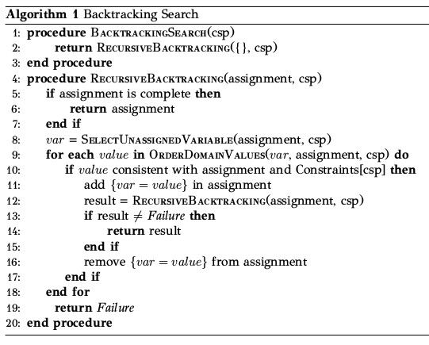

# Class Scheduling Program in Java

It is an implementation of a project in Artificial Intelligence course.
- We develop software in **Java**  which build a high school curriculum using state-space search algorithms.
- This problem belongs to **Constraint Satisfaction Problems**.

# Project Informations

We use an algorithm called backtracking search to solve this CSP problem. It's nothing but DFS (with the slightly different
implementation we discussed above) where when we find ourselves in a situation that violates some limitation, we go back and
try another value.

**_Pseudocode of BackTracking_**

 

# Implementation 

Since we want to fill hours in the program, each hour for each section for each class will be a separate variable. For example, if we have 5 days, 7 hours each day, 3 classes and 3 segments, 4 have a total of 5 × 7 × 3 × 3 = 315 different variables. Next, we find the domain of each variable. The most natural domain for our variables are the lessons that can be taught at any time (depending on the class). But this is how we ignore the teachers. So the right domain for variables is teacher-class pairs that can be taught / taught at any time (depending on class).Finally ,we set the constraints.

- **_Class_Lesson_**: this class will hold the details of each lesson
- **_Class_Teacher_**: this class will hold the details of each teacher SlotValue: this class will represent a teacher-lesson pair
- **_Assignment_**: this class will be the status / assignment as defined earlier for the problem

# Run Instractions

Just run from command MainClass.java 

